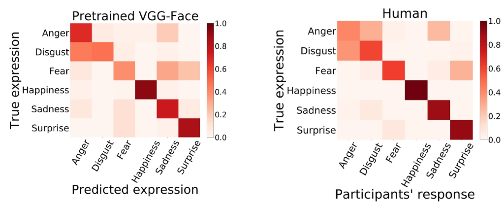

Face **identity** and **expression** have been traditionally viewed as separate process in the brain, evidenced by patient cases and neuroimaging studies (FFA/OFA VS STS). However, incresing evidence suggests that both informantion can be decoded from the ROIs (for example, FFA/OFA have been regarded as face identity region, but can also process facial expression information).

In this paper, we examine whether the **interdependence** of face identity and expression being is nessary from a computatioanl point of view. We used VGG-face, a network optimized for facial identity recognition, as the model to simulate cognitive process in the brain(Fig. 1). 

<figure>      <figcaption style="text-align:center;">Fig. 1 VGG-fece structure</figcaption> </figure>

We found **expression-selective units** in VGG-face, and more importantly, those units were **human-like**, which was evidenced by similar confusion matrix(Fig. 2) compared to human subjects and clear categorical perception of morphed expression continua, a hallmark of human expression recognition property. 

<figure>      <figcaption style="text-align:center;">Fig. 2 Confusion matrix of pretrained VGG-face and human</figcaption> </figure>

<figure>      
 <figcaption style="text-align:center;">Fig. 3 Categorical perception of facial expression contiua</figcaption> </figure>

Different from the biological system, DNN allows us to answer the **'why' quesiton** beyond phenomena description. By altering model architecture, training data, objective function or learning algorithm, we can test the theories that aim to explain behavioral and neural phenomena. 

In this study, we also probed expression-selective units in the following networks:

- VGG-16, same architecture with VGG-face, but optimized for object recognition
  - to test whether **domain-specific** or **domain-general** experience is necessary for facial expression representation
- Randomized VGG-face
  - to test the contribution of the architecture

Remarkably, while expression-selective units can be found in both networks, they are not human-like (Fig. 4), which highlights the domain-specific experience for facial expression representation. 

<figure>      
 <figcaption style="text-align:center;">Fig. 4 Expression selective units in VGG-16 and randomrized VGG-faced are not human-like</figcaption> </figure>

**See our work** on [Science Advance](https://www.science.org/doi/full/10.1126/sciadv.abj4383). 